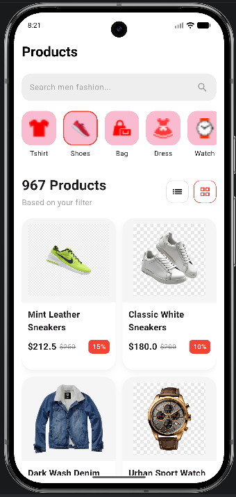

# Implementasi UI Katalog Produk dengan Flutter

Project ini dibuat untuk memenuhi tugas implementasi User Interface (UI) katalog produk menggunakan framework Flutter.

Pada aplikasi ini, saya membuat tampilan katalog produk fashion sederhana dengan konsep modern shopping app. Tampilan terdiri dari:

- Search bar
- Kategori produk horizontal
- Grid daftar produk
- Informasi harga produk
- Badge diskon

Dalam pembuatan project ini saya menerapkan beberapa widget fundamental Flutter seperti:

- Column
- Row
- ListView
- GridView
- Image
- Container
- Padding
- Expanded

Tampilan aplikasi dibuat menyesuaikan referensi desain yang diberikan dosen dengan beberapa penyesuaian warna dan asset agar terlihat lebih menarik.

---

# Tujuan Pembuatan

Tujuan dari project ini adalah:

1. Memahami cara menyusun layout menggunakan Flutter.
2. Memahami penggunaan widget dasar Flutter.
3. Mengimplementasikan scrolling horizontal dan vertical.
4. Memahami penggunaan asset image pada Flutter.
5. Melatih kemampuan membuat UI yang responsive dan rapi.

---

# Tampilan Aplikasi

## Halaman Product Catalog

Fitur yang terdapat pada halaman:

- AppBar sederhana
- Search field
- Kategori produk horizontal
- Product grid
- Harga produk
- Diskon produk

Tambahkan screenshot hasil aplikasi pada bagian ini.

Contoh:

```md

